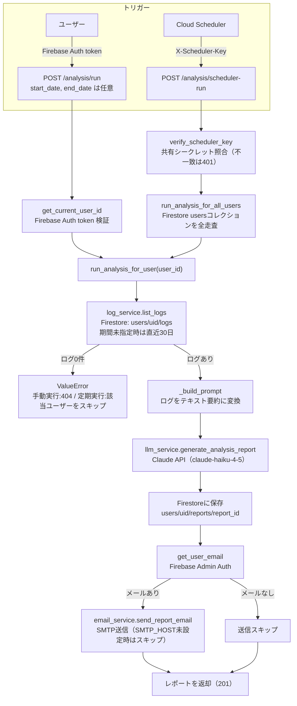

# アーキテクチャ設計

## 全体構成

```
[Firebase App Hosting]
  Next.js (TypeScript)
          ↓ Firebase Auth token
[Cloud Run]
  FastAPI (Python)
  ├── Firestore (Firebase Admin SDK)  ← CRUD
  ├── Claude API                      ← AI 分析
  └── Email 通知                      ← リマインダー・レポート配信
          ↑ 定期トリガー
[Cloud Scheduler]
  定期 AI 分析 / 毎日の入力リマインダー

[Firebase Auth]   ← 認証（全ユーザー共通）
[Firestore]       ← ライフログデータ・分析レポート
```

## データフロー

### ライフログ入力

```
ユーザー → Next.js → FastAPI（バリデーション・残業スコア算出）→ Firestore
```

### AI 分析（手動 or 定期）

```
Cloud Scheduler / 手動 → FastAPI → Firestore（ログ取得）→ Claude API → Firestore（レポート保存）→ Email 送信
```

#### 詳細フロー（実装: `backend/src/ai_health_checker/services/analysis_service.py`）

`run_analysis_for_user()` が分析実行の中心ロジック。手動実行（`POST /analysis/run`、
期間・切り口を指定可能）と Cloud Scheduler 定期実行（`POST /analysis/scheduler-run` →
全ユーザーをループして `run_analysis_for_user()` を呼ぶ `run_analysis_for_all_users()`）の
両方から呼ばれる、共通の1本のフロー。

役割分担（#96 で整理）:
- **手動実行**: 期間（プリセット/任意）と切り口（総合/疲労傾向/残業と気分/ジム習慣）を自由に指定するオンデマンド分析
- **定期実行**: 毎月1日に前月1日〜末日の総合サマリーを生成し、メールで通知する月次レポート



### 閲覧

```
Next.js → FastAPI → Firestore → 一覧 / グラフ表示
```

#### レポート一覧取得

```
ユーザー → GET /analysis/reports（Firebase Auth token）
  → analysis_service.list_reports → Firestore: users/uid/reports（created_at 降順）→ レスポンス
```

### 入力リマインダー（定期実行のみ）

実装: `backend/src/ai_health_checker/services/reminder_service.py`

```
Cloud Scheduler → POST /reminders/run（X-Scheduler-Key、#12 と共通の verify_scheduler_key）
  → reminder_service.run_reminders
  → users コレクションを全走査 → 各ユーザーについて log_service.list_logs で
     JST 基準の当日ログ有無を確認
  → 当日ログがなく、かつメールアドレスが取得できるユーザーにのみ
     email_service.send_reminder_email でリマインダーメールを送信
```

> Cloud Scheduler ジョブ自体（`gcloud scheduler jobs create ...`）は本リポジトリの管理外で、
> デプロイ済みの Cloud Run URL に対して手動で作成する。

---

## 設計上の決定事項

| 項目 | 決定 | 理由 |
|---|---|---|
| 認証 | Firebase Auth | マルチユーザー対応、Firebase エコシステムと統合 |
| CRUD | すべて FastAPI 経由 | 残業スコア算出等のビジネスロジックをバックエンドに集約 |
| フロントホスティング | Firebase App Hosting | Next.js ネイティブ対応 |
| バックエンドホスティング | Cloud Run | FastAPI コンテナをそのまま動かせる唯一の Firebase エコシステム選択肢 |
| DB | Firestore | Firebase Admin SDK で FastAPI から操作 |
| AI 連携 | Anthropic Claude API（anthropic SDK 直接呼び出し） | RAG は現時点で不要と判断し Dify を廃止（2026-07）。ユースケース上必要になった場合のみ再導入する |
| AI 出力形式 | テキストレポート（グラフ付き） | 将来チャット機能を追加予定 |
| 通知 | Email | 入力リマインダー + 分析レポート配信 |
| UI ライブラリ | 未定（後で検討） | — |

---

## mono-repo ディレクトリ構成

```
ai-health-checker/
├── backend/                      # FastAPI (Cloud Run)
│   ├── src/ai_health_checker/
│   │   ├── main.py
│   │   ├── routers/
│   │   ├── models/
│   │   └── services/
│   ├── tests/
│   ├── Dockerfile
│   └── requirements.in
├── frontend/                     # Next.js (App Hosting)
│   ├── src/
│   ├── public/
│   └── package.json
├── docs/                         # 要件・設計ドキュメント
│   ├── requirements.md
│   └── architecture.md
├── .github/workflows/
├── CLAUDE.md
└── firebase.json
```

---

## 将来拡張候補

- Apple Health 連携（睡眠・体重）
- カレンダービュー
- AI チャット深掘り機能
- レポート PDF 保存（Cloud Storage）
